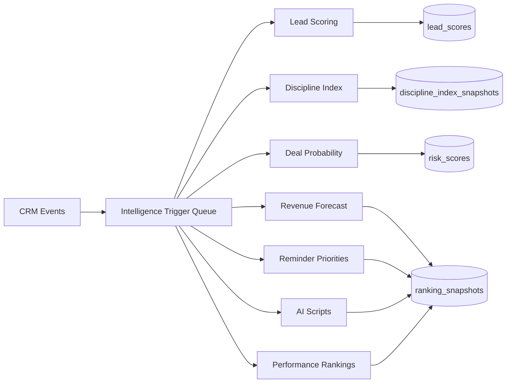

# CRM Intelligence Layer

## Overview

The intelligence layer provides seven real-time decision modules: lead scoring, discipline index, deal probability, revenue forecast, reminder prioritization, AI scripts, and performance ranking. Calculations are triggered by CRM events and available via API endpoints.

## API Endpoints

### Lead Scoring

- POST /api/intelligence/leads/:leadId/score
- Response: LeadScore record with factors and tier

### Discipline Index

- POST /api/intelligence/discipline/users/:userId
- Response: DisciplineIndexSnapshot

### Deal Probability

- POST /api/intelligence/deals/:dealId/probability
- Response: RiskScore with probability and confidence interval

### Revenue Forecast

- POST /api/intelligence/forecast
- Response: Monthly, quarterly, annual forecast payload

### Smart Reminder Priorities

- POST /api/intelligence/reminders/priority
- Body: { userId? }
- Response: Prioritized reminders list

### AI Script Generator

- POST /api/intelligence/leads/:leadId/scripts
- Body: { stage? }
- Response: Script blocks by stage

### Performance Ranking

- POST /api/intelligence/rankings/performance
- Response: Ranking rows for users

### Engagement Webhook

- POST /api/intelligence/webhooks/engagement
- Body: { tenantId?, leadId, type, occurredAt?, metadata? }

### Trigger Webhook

- POST /api/intelligence/webhooks/triggers
- Body: { tenantId?, type, leadId?, dealId?, userId? }

## Trigger Sources

- Lead create/update/assign/task/call
- Lead lifecycle transitions and deadlines
- Deal/offer creation
- Meeting creation/reschedule/reminders
- Notification events for engagement

## Data Flow

## Deployment

1. Apply prisma migrations if schema changes are introduced.
2. Ensure module key "intelligence" exists for tenant configs.
3. Configure notification event producers for engagement events.
4. Set API gateway to allow /api/intelligence endpoints.

## Performance Targets

- All intelligence calculations target <200ms per trigger under normal tenant data sizes.
- Calculations are executed asynchronously after data writes.

## Configuration

Module config keys (JSON) for module key "intelligence":

- leadScoreWeights
- disciplineWeights
- thresholds
- engagementWeights
- dealStageBase
- targetPropertyTypes
- targetLocations
- companySizeScores
- industryScores
